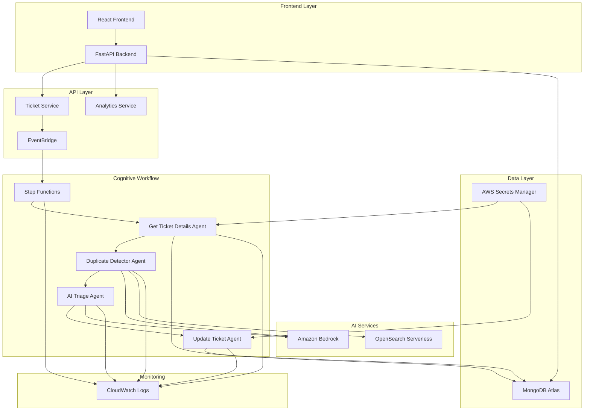

# Design Document

## Overview

The PriorityOps system implements a serverless, event-driven architecture using AWS services to provide intelligent IT support ticket management. The core innovation is a cognitive workflow powered by AWS Step Functions that orchestrates multiple AI agents implemented as Lambda functions to automatically process, triage, and manage support tickets.

## Architecture

### High-Level Architecture



### Event-Driven Processing Flow

1. **Ticket Creation**: User submits ticket via React frontend
2. **Event Trigger**: FastAPI backend publishes event to EventBridge
3. **Workflow Execution**: Step Functions orchestrates AI agent pipeline
4. **AI Processing**: Lambda agents process ticket through cognitive workflow
5. **Database Update**: Final agent updates ticket with AI insights
6. **Frontend Refresh**: Real-time updates displayed to users

## Components and Interfaces

### Lambda Agents

#### Get Ticket Details Agent
- **Purpose**: Retrieves complete ticket data from MongoDB Atlas
- **Input**: `{ "ticket_id": "string" }`
- **Output**: Complete ticket document with metadata
- **Dependencies**: MongoDB Atlas, AWS Secrets Manager
- **Runtime**: Python 3.11, 512MB memory, 30s timeout

#### Duplicate Detector Agent
- **Purpose**: Identifies duplicate tickets using semantic similarity
- **Input**: Ticket document from previous agent
- **Output**: Ticket data + duplicate analysis results
- **AI Services**: Amazon Bedrock (Titan Embeddings), OpenSearch Serverless
- **Algorithm**: Vector similarity search with 0.9 threshold
- **Runtime**: Python 3.11, 1GB memory, 60s timeout

#### AI Triage Agent
- **Purpose**: Classifies priority, category, and generates solution recommendations
- **Input**: Ticket data + duplicate check results
- **Output**: Ticket data + triage analysis (priority, category, confidence, solutions)
- **AI Services**: Amazon Bedrock (Claude 3 Sonnet)
- **Runtime**: Python 3.11, 1GB memory, 120s timeout

#### Update Ticket Agent
- **Purpose**: Persists AI analysis results back to MongoDB
- **Input**: Complete workflow results from all previous agents
- **Output**: Success/failure status
- **Dependencies**: MongoDB Atlas, AWS Secrets Manager
- **Runtime**: Python 3.11, 512MB memory, 30s timeout

### Step Functions Workflow

```json
{
  "Comment": "PriorityOps Cognitive Workflow",
  "StartAt": "GetTicketDetails",
  "States": {
    "GetTicketDetails": {
      "Type": "Task",
      "Resource": "arn:aws:lambda:region:account:function:get-ticket-details",
      "Retry": [
        {
          "ErrorEquals": ["States.TaskFailed"],
          "IntervalSeconds": 2,
          "MaxAttempts": 3,
          "BackoffRate": 2.0
        }
      ],
      "Next": "DuplicateDetector"
    },
    "DuplicateDetector": {
      "Type": "Task",
      "Resource": "arn:aws:lambda:region:account:function:duplicate-detector",
      "Retry": [
        {
          "ErrorEquals": ["States.TaskFailed"],
          "IntervalSeconds": 2,
          "MaxAttempts": 3,
          "BackoffRate": 2.0
        }
      ],
      "Next": "AITriage"
    },
    "AITriage": {
      "Type": "Task",
      "Resource": "arn:aws:lambda:region:account:function:ai-triage",
      "Retry": [
        {
          "ErrorEquals": ["States.TaskFailed"],
          "IntervalSeconds": 2,
          "MaxAttempts": 3,
          "BackoffRate": 2.0
        }
      ],
      "Next": "UpdateTicket"
    },
    "UpdateTicket": {
      "Type": "Task",
      "Resource": "arn:aws:lambda:region:account:function:update-ticket",
      "Retry": [
        {
          "ErrorEquals": ["States.TaskFailed"],
          "IntervalSeconds": 2,
          "MaxAttempts": 3,
          "BackoffRate": 2.0
        }
      ],
      "End": true
    }
  }
}
```

### FastAPI Backend Integration

#### Event Publishing
```python
# Trigger cognitive workflow when ticket is created
async def create_ticket(ticket_data: TicketCreate):
    # Save ticket to MongoDB
    ticket = await ticket_service.create_ticket(ticket_data)
    
    # Publish event to trigger AI processing
    await event_publisher.publish_ticket_created(ticket.id)
    
    return ticket
```

#### Workflow Status Monitoring
```python
# Check cognitive workflow status
async def get_ticket_processing_status(ticket_id: str):
    execution_arn = await get_execution_arn(ticket_id)
    status = await step_functions_client.describe_execution(execution_arn)
    return {
        "status": status["status"],
        "start_time": status["startDate"],
        "current_step": extract_current_step(status)
    }
```

## Data Models

### Ticket Document (MongoDB)
```python
{
    "_id": ObjectId,
    "title": str,
    "description": str,
    "priority": str,  # Set by AI Triage Agent
    "status": str,
    "category": str,  # Set by AI Triage Agent
    "department": str,
    "assignee": str,
    "created_at": datetime,
    "updated_at": datetime,
    "resolved_at": datetime,
    "escalated_at": datetime,
    
    # AI-generated fields
    "confidence_score": int,  # 0-100
    "estimated_resolution_time": str,
    "recommended_solution_steps": [str],
    "duplicate_of": str,  # Reference to original ticket if duplicate
    
    # Audit trail
    "agent_history": [
        {
            "timestamp": str,
            "agent": str,
            "action": str
        }
    ]
}
```

### Vector Document (OpenSearch)
```python
{
    "ticket_id": str,
    "title": str,
    "description": str,
    "ticket_vector": [float],  # 1536-dimensional embedding
    "created_at": str
}
```

### Workflow Event (EventBridge)
```python
{
    "source": "priorityops.tickets",
    "detail-type": "Ticket Created",
    "detail": {
        "ticket_id": str,
        "priority": str,
        "department": str
    }
}
```

## Error Handling

### Lambda Function Error Handling
- **Retry Logic**: Exponential backoff with jitter (2s, 4s, 8s intervals)
- **Dead Letter Queues**: Failed executions sent to SQS for manual review
- **Circuit Breaker**: Temporary disable agents if error rate exceeds 50%
- **Graceful Degradation**: Continue workflow even if non-critical agents fail

### Step Functions Error Handling
- **State-level Retries**: Each state has independent retry configuration
- **Catch Blocks**: Handle specific error types with appropriate responses
- **Fallback States**: Alternative processing paths for common failure scenarios
- **Execution Timeout**: 15-minute maximum execution time with alerts

### Database Connection Resilience
- **Connection Pooling**: Reuse connections across Lambda invocations
- **Automatic Reconnection**: Handle network timeouts and connection drops
- **Read Replicas**: Use read replicas for non-critical operations
- **Secrets Rotation**: Automatic handling of credential rotation

## Testing Strategy

### Unit Testing
- **Lambda Functions**: Test each agent in isolation with mocked dependencies
- **Business Logic**: Test AI processing logic with sample ticket data
- **Error Scenarios**: Test failure modes and error handling paths
- **Performance**: Load test individual functions with realistic payloads

### Integration Testing
- **End-to-End Workflow**: Test complete Step Functions execution
- **AWS Service Integration**: Test Bedrock, OpenSearch, and Secrets Manager integration
- **Database Operations**: Test MongoDB operations under load
- **Event Processing**: Test EventBridge event handling and routing

### Performance Testing
- **Concurrent Execution**: Test 1000+ concurrent workflow executions
- **Latency Requirements**: Ensure <5 minute end-to-end processing
- **Throughput Testing**: Validate system handles peak ticket volumes
- **Cost Optimization**: Monitor AWS costs under various load patterns

### Security Testing
- **IAM Permissions**: Verify least-privilege access for all components
- **Data Encryption**: Test encryption in transit and at rest
- **Secrets Management**: Validate secure credential handling
- **Network Security**: Test VPC configuration and security groups

## Deployment Architecture

### Infrastructure as Code
- **AWS SAM Templates**: Define Lambda functions, Step Functions, and IAM roles
- **CloudFormation Stacks**: Manage related resources as cohesive units
- **Parameter Store**: Environment-specific configuration management
- **Cross-Stack References**: Share resources between application components

### CI/CD Pipeline
- **Source Control**: Git-based workflow with feature branches
- **Build Process**: Automated testing and packaging of Lambda functions
- **Deployment Stages**: Development → Staging → Production promotion
- **Rollback Strategy**: Automated rollback on deployment failures

### Monitoring and Observability
- **CloudWatch Metrics**: Custom metrics for AI agent performance
- **Distributed Tracing**: X-Ray tracing for end-to-end request tracking
- **Log Aggregation**: Centralized logging with structured log formats
- **Alerting**: CloudWatch alarms for critical system metrics

### Security and Compliance
- **Encryption**: KMS encryption for all data at rest
- **Network Isolation**: VPC endpoints for AWS service communication
- **Access Control**: IAM roles with minimal required permissions
- **Audit Logging**: CloudTrail logging for all API calls and resource changes